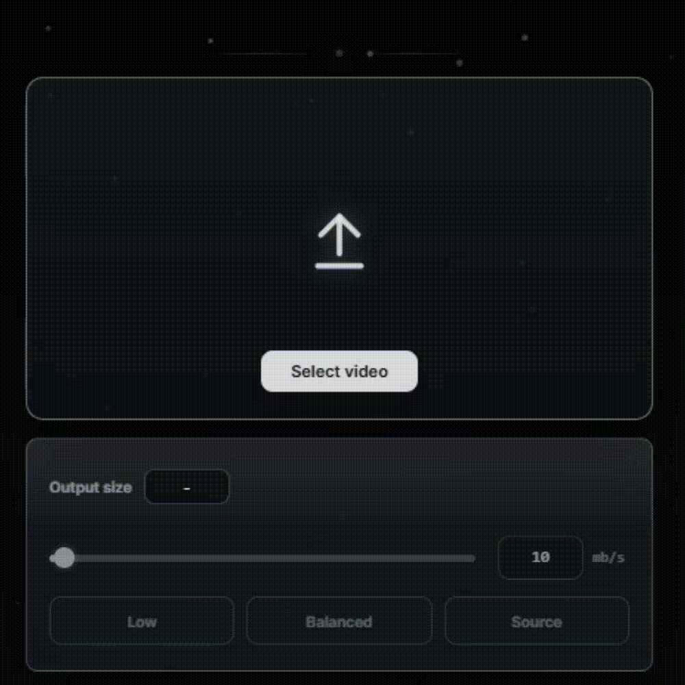
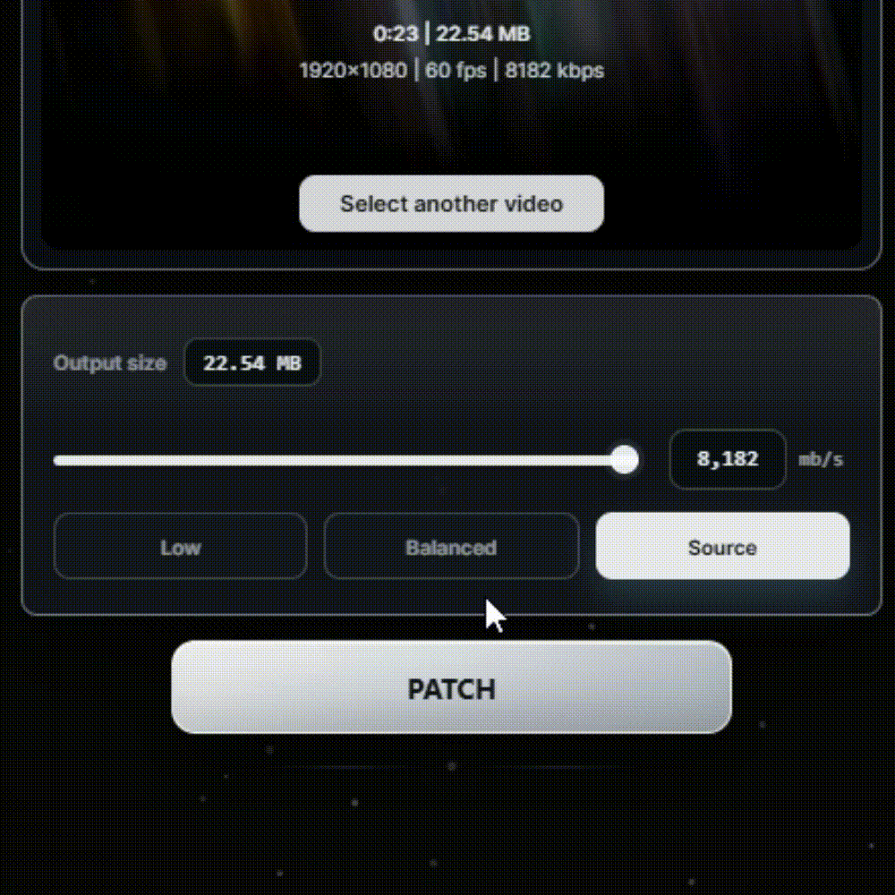
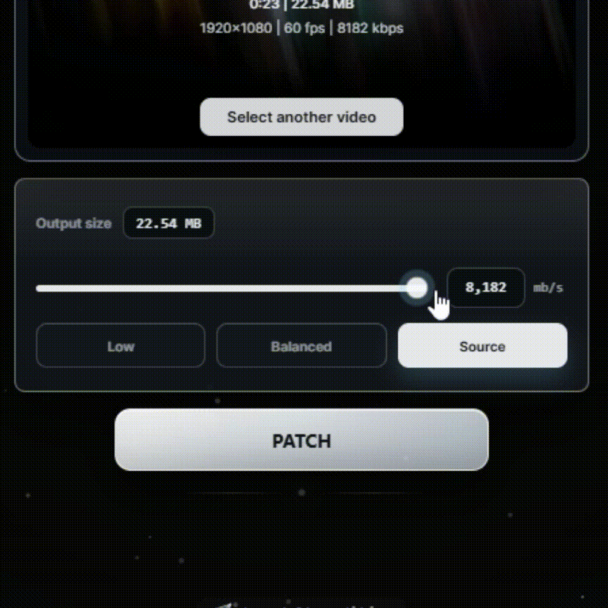
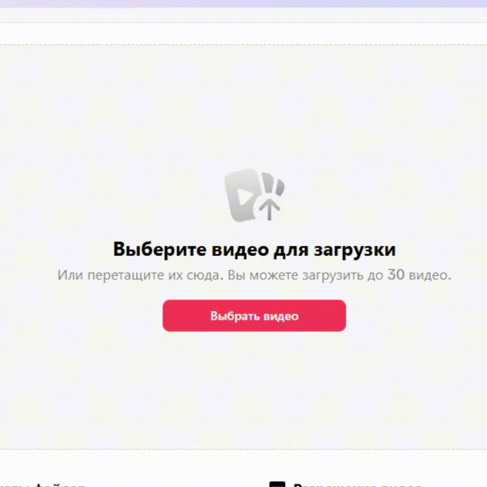

# Alter Editing Method

Desktop video patcher for MP4/MOV processing with Telegram-based authorization and auto-updates.

## License

This project is licensed under `GPL-3.0-only`. See `LICENSE`.

## Key Features

- MP4/MOV input support
- Metadata probing with bundled `ffprobe`
- Preview generation with bundled `ffmpeg`
- Patch modes: `low`, `balanced`, `source`
- Auto-update flow via GitHub Releases
- Telegram-based authorization flow

## Development

```powershell
npm install
npm start
```

## Build Installer

Local artifacts:

```powershell
npm run dist:win
```

Publish release artifacts:

```powershell
npm run release:win
```

Expected artifacts:

- `AlterEditingMethod-Setup-<version>.exe`
- `AlterEditingMethod-Setup-<version>.exe.blockmap`
- `latest.yml`

## Code Signing And Certificate Readiness

For trusted Windows installers (and SmartScreen reputation), use a valid code-signing certificate and sign release artifacts in CI.
Code signing for this project is provided by the SignPath Foundation.

Environment variables for Windows code-signing:

- `CSC_LINK` / `CSC_KEY_PASSWORD`
- or Windows-specific `WIN_CSC_LINK` / `WIN_CSC_KEY_PASSWORD`

Release hardening checklist is documented in `RELEASE_CHECKLIST.md`.

## Runtime Configuration

You can configure auth API base URL via environment variable:

- `ALTERE_AUTH_API_BASE` (example: `https://auth.example.com`)
- `ALTERE_AUTH_API_FALLBACKS` (comma-separated backup URLs)
- `ALTERE_TELEGRAM_CHANNEL_URL` (footer channel link)

If not set, default is:

- `http://132.243.30.159:3000`

The client can also refresh server-side links from `/client-config` and switch to a responsive fallback backend automatically.

## FFmpeg Note

This project expects local FFmpeg binaries at:

- `vendor/ffmpeg/ffmpeg.exe`
- `vendor/ffmpeg/ffprobe.exe`

These binaries are ignored by git. For licensing details and release obligations, see:

- `THIRD_PARTY_NOTICES.md`

## Open Source Governance

- Contribution guide: `CONTRIBUTING.md`
- Security policy: `SECURITY.md`
- Code of conduct: `CODE_OF_CONDUCT.md`
- Privacy notice: `PRIVACY.md`
- Code signing policy: `CODE_SIGNING_POLICY.md`
## How to Use / Как пользоваться

### English

1. Drag and drop a video file into the app, or select it manually.  
   

2. Choose a bitrate, or keep the original source quality.  
   

   > Note: 2K/4K video or bitrate above 50 Mbps is not recommended, because there is a risk of TikTok account restrictions.

3. Click the `PATCH` button and wait until processing is complete.  
   

4. Upload the processed video to TikTok using your preferred standard upload method, without additional third-party methods.  
   

### Русский

1. Перетащите видео в приложение или выберите его вручную.  
   

2. Выберите битрейт или оставьте исходное качество видеофайла.  
   

   > Примечание: Видео в 2K/4K или с битрейтом выше 50 Mbps не рекомендуется, так как есть риск ограничений аккаунта TikTok.

3. Нажмите кнопку `PATCH` и дождитесь завершения обработки.  
   

4. Загрузите обработанное видео в TikTok удобным для вас стандартным способом, без использования дополнительных сторонних методов.  
   

